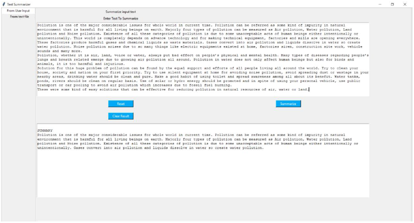
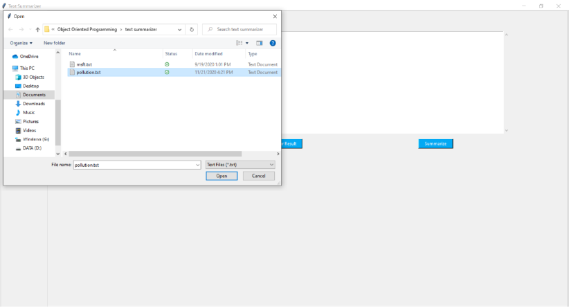
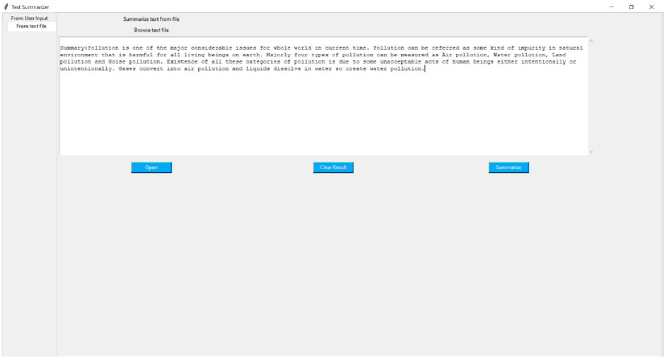

# Text Summarizer
Extractive text summarization using unsupervised technique. 

## Contents

- [Overview](#overview)
- [Screen Captures](#screen-captures)
  - [Direct summary of text provided](#direct-summary-of-text-provided)
  - [Summary from File](#summary-from-file)
- [Features](#features)
- [Dependencies](#dependencies)
- [Setup](#setup)

## Overview

This application generates extractive text summary using unsupervised technique and page rank algorithm. It can directly generate summary of contents of a file(`.txt`) or of the text entered in the text box of the application.

## Screen Captures

Screen captures of the application showing its functionality:

### Direct summary of text provided

Content in upper text box is entered by user and lower text box contains its summary.


### Summary from File

Selecting a text file to generate summary. <br>

<br>
Summary of the content of the file
<br>


## Features

- User friendly easy to use interface.
- Generates summary of contents of a file as well as of the raw text provided to application in text box.
- Uses modified page rank algorithm to generate unbiased summary containing every aspect of the article.

## Dependencies

- `python == 3.8.2`
- `tk`
- `nltk == 3.6.3`
- `numpy == 1.21.2`

## Setup

- The system should have [python](https://www.python.org/downloads/) installed on it.
- Clone the repository on your device.
- Fullfill the requirements by installing the dependencies.
```sh
pip install numpy==1.21.2 nltk==3.6.3 tk` 
```
